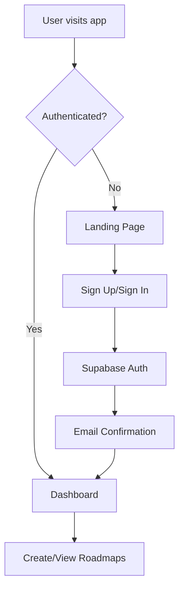

# 🚀 SmartLearn.io - AI-Powered Roadmap Generator

<div align="center">
  
  
  **Transform your goals into clear, visual learning roadmaps with AI assistance**
  
  [](https://smartlearn.io)
  [](LICENSE)
  [](https://reactjs.org/)
  [](https://www.typescriptlang.org/)
  [](https://supabase.com/)
</div>

## 📋 Table of Contents

- [✨ Features](#-features)
- [🎯 Demo](#-demo)
- [🛠️ Tech Stack](#️-tech-stack)
- [🚀 Quick Start](#-quick-start)
- [⚙️ Installation](#️-installation)
- [🔧 Configuration](#-configuration)
- [📱 Usage](#-usage)
- [🏗️ Architecture](#️-architecture)
- [🌐 Deployment](#-deployment)
- [🔌 API Reference](#-api-reference)
- [🎨 Customization](#-customization)
- [🤝 Contributing](#-contributing)
- [📄 License](#-license)

## ✨ Features

### 🎯 Core Features
- **AI-Powered Roadmap Generation**: Leverages Google's Gemini AI to create personalized learning paths
- **Interactive Tree Visualization**: Beautiful, interactive roadmap canvas with React Flow
- **Multi-Category Support**: Kitchen recipes, travel planning, project management, and fitness planning
- **Phase-Based Structure**: Each roadmap contains multiple phases with exactly 4 steps per phase
- **Smart Step Distribution**: Steps are intelligently distributed (2 left, 2 right) for optimal visualization

### 🔐 Authentication & User Management
- **Secure Authentication**: Email/password authentication with Supabase Auth
- **User Dashboard**: Personal dashboard to view and manage all saved roadmaps
- **Auto-Save Functionality**: Roadmaps are automatically saved after generation
- **User Data Protection**: Row-level security ensures users only see their own data

### 🎨 User Experience
- **Responsive Design**: Fully responsive across all device sizes
- **Real-time Progress Tracking**: Track completion status for each step
- **Keyboard Navigation**: Navigate between phases and steps using arrow keys
- **Modal Interactions**: Detailed views for phases and individual steps
- **Smooth Animations**: Fluid transitions and micro-interactions throughout

### 🎥 Rich Media Integration
- **YouTube Video Integration**: AI-generated relevant tutorial videos for each step
- **Interactive Maps**: Embedded Google Maps for travel planning with location-specific guidance
- **AI-Powered Instructions**: Generate detailed step-by-step instructions using Mistral AI
- **PDF Export**: Download beautifully formatted PDF versions of your roadmaps

### 🔧 Technical Features
- **TypeScript**: Full type safety and enhanced developer experience
- **Modern React**: Built with React 18+ and modern hooks
- **Tailwind CSS**: Utility-first styling with custom theme system
- **Express Backend**: Robust Node.js/Express server with CORS support
- **Supabase Integration**: Full-stack authentication and database management
- **Error Handling**: Comprehensive error handling and fallback mechanisms
- **Performance Optimized**: Memoized components and efficient re-rendering

## 🎯 Demo

🌐 **Live Demo**: [https://flowniq.netlify.app](https://flowniq.netlify.app)

### Example Roadmaps
- **Learning React**: 3-phase roadmap from basics to advanced concepts
- **Planning a Trip to Japan**: Complete travel planning with cultural insights and maps
- **Building a SaaS Product**: End-to-end product development roadmap
- **Getting Fit in 90 Days**: Structured fitness journey with nutrition guidance

## 🛠️ Tech Stack

### Frontend
- **React 18.3.1** - Modern React with concurrent features
- **TypeScript 5.5.3** - Type-safe JavaScript
- **Tailwind CSS 3.4.1** - Utility-first CSS framework
- **React Flow 12.0.4** - Interactive node-based diagrams
- **React Router DOM 6.20.1** - Client-side routing
- **Lucide React** - Beautiful, customizable icons
- **Vite 5.4.2** - Fast build tool and dev server

### Backend
- **Node.js** - JavaScript runtime
- **Express 4.18.2** - Web application framework
- **Google Generative AI** - Gemini AI integration
- **Mistral AI** - Additional AI capabilities for instructions
- **CORS 2.8.5** - Cross-origin resource sharing
- **dotenv 16.5.0** - Environment variable management

### Database & Authentication
- **Supabase** - Backend-as-a-Service platform
- **PostgreSQL** - Robust relational database
- **Row Level Security** - Data protection and user isolation
- **Real-time subscriptions** - Live data updates

### Development Tools
- **ESLint** - Code linting and formatting
- **TypeScript ESLint** - TypeScript-specific linting rules
- **Autoprefixer** - CSS vendor prefixing
- **Concurrently** - Run multiple commands simultaneously

## 🚀 Quick Start

```bash
# Clone the repository
git clone https://github.com/yourusername/flowniq.ai.git
cd flowniq

# Install dependencies
npm install

# Set up environment variables
cp .env.example .env
# Edit .env with your API keys and Supabase credentials

# Start development servers (frontend + backend)
npm run dev

# Open your browser
# Frontend: http://localhost:5173
# Backend: http://localhost:3001
```

## ⚙️ Installation

### Prerequisites
- **Node.js** (v18 or higher)
- **npm** or **yarn**
- **Supabase Account** (for database and authentication)
- **Google Gemini API Key** (required)
- **Mistral AI API Key** (required)

### Step-by-Step Installation

1. **Clone the Repository**
   ```bash
   git clone https://github.com/yourusername/flowniq.ai.git
   cd flowniq
   ```

2. **Install Dependencies**
   ```bash
   npm install
   ```

3. **Set up Supabase**
   - Create a new project at [supabase.com](https://supabase.com)
   - Go to Settings > API to get your project URL and anon key
   - Run the database migration (see Configuration section)

4. **Environment Setup**
   ```bash
   cp .env.example .env
   ```

5. **Configure Environment Variables**
   ```env
   # AI API Keys (optional but recommended)
   GEMINI_API_KEY=your_gemini_api_key_here
   MISTRAL_API_KEY=your_mistral_api_key_here
   
   # Server configuration
   PORT=3001
   
   # Supabase configuration (required)
   VITE_SUPABASE_URL=your_supabase_project_url
   VITE_SUPABASE_ANON_KEY=your_supabase_anon_key
   ```

6. **Set up Database**
   - Connect to Supabase and run the migration file
   - The migration will create the roadmaps table with proper RLS policies

7. **Start Development**
   ```bash
   # Start both frontend and backend
   npm run dev
   
   # Or start individually
   npm run server  # Backend only
   npx vite        # Frontend only
   ```

## 🔧 Configuration

### Environment Variables

| Variable | Description | Required | Default |
|----------|-------------|----------|---------|
| `VITE_SUPABASE_URL` | Supabase project URL | Yes | - |
| `VITE_SUPABASE_ANON_KEY` | Supabase anonymous key | Yes | - |
| `GEMINI_API_KEY` | Google Gemini AI API key | Yes | - |
| `MISTRAL_API_KEY` | Mistral AI API key | Yes | - |
| `PORT` | Backend server port | No | 3001 |

*Note: Without AI API keys, the app runs in fallback mode with pre-defined roadmap templates.

### Getting API Keys

#### Supabase Setup
1. Visit [supabase.com](https://supabase.com) and create an account
2. Create a new project
3. Go to Settings > API to get your project URL and keys
4. Copy the URL and anon key to your `.env` file

#### Gemini API Key
1. Visit [Google AI Studio](https://makersuite.google.com/app/apikey)
2. Sign in with your Google account
3. Create a new API key
4. Copy the key to your `.env` file

#### Mistral AI Key
1. Visit [Mistral AI Console](https://console.mistral.ai/)
2. Create an account and get your API key
3. Copy the key to your `.env` file

### Database Migration

The app includes a Supabase migration file that sets up:
- `roadmaps` table with proper schema
- Row Level Security (RLS) policies
- Indexes for performance
- Triggers for automatic timestamps

To apply the migration:
1. Connect to your Supabase project
2. Run the SQL migration file located in `supabase/migrations/`

## 📱 Usage

### Getting Started

1. **Sign Up**: Create an account using email and password
2. **Email Confirmation**: Check your email and confirm your account (if enabled)
3. **Dashboard**: Access your personal dashboard to view saved roadmaps
4. **Create Roadmap**: Click the "+" button to create a new roadmap

### Creating a Roadmap

1. **Select Category**: Choose from Kitchen Recipe, Travel Planner, Project, or Fitness Planner
2. **Describe Goal**: Enter a detailed description of what you want to achieve
3. **Travel Planning**: For travel category, answer additional questions about destination, duration, etc.
4. **Generate**: Click "Generate" to create your AI-powered roadmap
5. **Auto-Save**: The roadmap is automatically saved to your account

### Navigation Controls

- **Mouse**: Click and drag to pan, scroll to zoom
- **Keyboard**: Use ← → arrow keys to navigate between phases/steps in modals
- **Sidebar**: Track progress and expand/collapse phases
- **Modals**: Click on phases or steps for detailed information

### Progress Tracking

- Click checkboxes in the sidebar to mark steps as completed
- View overall progress with the progress bar
- Only one phase expanded at a time for focused learning

### Media Integration

- **YouTube Videos**: Watch relevant tutorial videos for each step
- **Interactive Maps**: Explore locations for travel planning
- **AI Instructions**: Generate detailed step-by-step guidance
- **PDF Export**: Download formatted roadmaps for offline use

## 🏗️ Architecture

### Project Structure

```
flowniq/
├── public/                 # Static assets
│   └── chartly_logo.png   # Application logo
├── server/                # Backend server
│   └── index.js          # Express server with AI integration
├── src/
│   ├── components/       # React components
│   │   ├── auth/         # Authentication components
│   │   ├── dashboard/    # Dashboard components
│   │   ├── CustomEdge.tsx           # Custom React Flow edges
│   │   ├── CustomRoadmapNode.tsx    # Custom React Flow nodes
│   │   ├── MessageInput.tsx         # Input component for goals
│   │   ├── Navbar.tsx              # Navigation component
│   │   ├── NodeDetail.tsx           # Step detail modal
│   │   ├── PhaseDetail.tsx          # Phase detail modal
│   │   ├── ProtectedRoute.tsx       # Route protection
│   │   ├── RoadmapCanvas.tsx        # Main canvas component
│   │   └── StepsPanel.tsx           # Sidebar progress panel
│   ├── contexts/         # React contexts
│   │   └── AuthContext.tsx          # Authentication context
│   ├── lib/              # Library configurations
│   │   └── supabase.ts              # Supabase client setup
│   ├── pages/            # Page components
│   │   ├── CreateRoadmapPage.tsx    # Roadmap creation page
│   │   └── RoadmapViewerPage.tsx    # Roadmap viewing page
│   ├── services/         # API services
│   │   ├── api.ts                   # Backend communication
│   │   └── roadmapService.ts        # Database operations
│   ├── types/            # TypeScript definitions
│   │   └── index.ts                 # Core type definitions
│   ├── utils/            # Utility functions
│   │   ├── mockAI.ts                # Fallback roadmap generation
│   │   └── themes.ts                # Category theme system
│   ├── App.tsx           # Main application component
│   └── main.tsx          # Application entry point
├── supabase/             # Database migrations
│   └── migrations/       # SQL migration files
├── .env.example          # Environment variables template
├── package.json          # Dependencies and scripts
└── README.md            # This file
```

### Authentication Flow



### Data Flow

1. **User Authentication** → Supabase Auth
2. **Roadmap Creation** → AI Processing → Database Storage
3. **Data Retrieval** → RLS-protected queries
4. **Real-time Updates** → Supabase subscriptions
5. **Media Integration** → AI-generated content

## 🌐 Deployment

### Frontend Deployment (Netlify)

The frontend is automatically deployed to Netlify:

🌐 **Live URL**: [https://flowniq.netlify.app](https://flowniq.netlify.app)

For manual deployment:

```bash
# Build the project
npm run build

# Deploy to Netlify (install Netlify CLI first)
npm install -g netlify-cli
netlify deploy --prod --dir=dist
```

### Backend Deployment (Render)

#### Step 1: Prepare for Render Deployment

1. **Update CORS Configuration** in `server/index.js`:
   ```javascript
   app.use(cors({
     origin: [
       'http://localhost:5173', 
       'http://127.0.0.1:5173',
       'https://flowniq.netlify.app',  // Your frontend URL
       'https://your-backend-name.onrender.com'  // Your Render backend URL
     ],
     credentials: true
   }));
   ```

#### Step 2: Deploy to Render

1. **Connect Repository**:
   - Go to [Render Dashboard](https://dashboard.render.com)
   - Click "New +" → "Web Service"
   - Connect your GitHub repository

2. **Configure Service**:
   - **Name**: `flowniq-backend`
   - **Environment**: `Node`
   - **Build Command**: `npm install`
   - **Start Command**: `node server/index.js`

3. **Set Environment Variables**:
   - `GEMINI_API_KEY`: Your Google Gemini API key
   - `MISTRAL_API_KEY`: Your Mistral AI API key
   - `PORT`: 10000 (Render's default)

### Database Deployment (Supabase)

Supabase handles database hosting automatically:

1. **Production Database**: Automatically provisioned with your Supabase project
2. **Migrations**: Apply the migration file to set up tables and policies
3. **Backups**: Automatic daily backups included
4. **Scaling**: Automatic scaling based on usage

## 🔌 API Reference

### Authentication Endpoints

All authentication is handled by Supabase Auth:

- **Sign Up**: `supabase.auth.signUp()`
- **Sign In**: `supabase.auth.signInWithPassword()`
- **Sign Out**: `supabase.auth.signOut()`

### Roadmap Endpoints

#### Generate Roadmap
```http
POST /api/generate-roadmap
```

**Request Body**:
```json
{
  "prompt": "Learn React development",
  "category": "project",
  "travelData": {
    "destination": "Paris",
    "startingLocation": "New York",
    "duration": 7,
    "travelers": 2,
    "budget": 3000
  }
}
```

#### Generate AI Instructions
```http
POST /api/generate-instructions
```

**Request Body**:
```json
{
  "stepDescription": "Learn React hooks and state management"
}
```

#### Health Check
```http
GET /api/health
```

### Database Operations

All database operations use Supabase client with RLS:

```typescript
// Create roadmap
const { data, error } = await supabase
  .from('roadmaps')
  .insert(roadmapData);

// Get user roadmaps
const { data, error } = await supabase
  .from('roadmaps')
  .select('*')
  .eq('user_id', user.id);
```

## 🎨 Customization

### Adding New Categories

1. **Update Types** (`src/types/index.ts`):
   ```typescript
   export type Category = 'existing_categories' | 'new_category';
   ```

2. **Add Theme** (`src/utils/themes.ts`):
   ```typescript
   new_category: {
     primary: '#your-color',
     secondary: '#your-secondary-color',
     accent: '#your-accent-color',
     background: '#your-background-color',
     text: '#your-text-color'
   }
   ```

3. **Update UI Components** with new category options

### Customizing AI Prompts

Edit the prompt templates in `server/index.js` to customize AI behavior for different categories.

### Styling Customization

The app uses Tailwind CSS with a custom theme system:

- **Colors**: Update category themes in `src/utils/themes.ts`
- **Components**: Each component has its own styling
- **Responsive**: Built-in responsive design patterns

## 🤝 Contributing

We welcome contributions! Here's how to get started:

### Development Setup

1. **Fork the Repository**
2. **Clone Your Fork**
3. **Create Feature Branch**: `git checkout -b feature/amazing-feature`
4. **Make Changes** and test thoroughly
5. **Commit Changes**: `git commit -m 'Add amazing feature'`
6. **Push to Branch**: `git push origin feature/amazing-feature`
7. **Open Pull Request**

### Contribution Guidelines

- **Code Style**: Follow existing TypeScript and React patterns
- **Testing**: Test your changes across different categories and scenarios
- **Documentation**: Update README.md if adding new features
- **Database**: Test migrations and RLS policies thoroughly

### Areas for Contribution

- 🎨 **UI/UX Improvements**: Enhanced animations, better responsive design
- 🤖 **AI Integration**: Support for other AI providers
- 📊 **Analytics**: User behavior tracking and roadmap analytics
- 🔧 **Features**: Advanced export options, sharing capabilities
- 🌐 **Internationalization**: Multi-language support
- 📱 **Mobile**: Enhanced mobile experience and PWA features

## 📄 License

This project is licensed under the MIT License - see the [LICENSE](LICENSE) file for details.

## 🙏 Acknowledgments

- **Google Gemini AI** - For powering intelligent roadmap generation
- **Mistral AI** - For detailed instruction generation
- **Supabase** - For authentication and database infrastructure
- **React Flow** - For beautiful interactive diagrams
- **Tailwind CSS** - For utility-first styling system
- **Lucide React** - For the beautiful icon system
- **Netlify** - For seamless frontend deployment
- **Render** - For reliable backend hosting

## 📞 Support

- **Issues**: [GitHub Issues](https://github.com/yourusername/flowniq.ai/issues)
- **Discussions**: [GitHub Discussions](https://github.com/yourusername/flowniq.ai/discussions)
- **Email**: flowniqai@gmail.com

---

<div align="center">
  <p>Made with ❤️ by the Flowniq Team</p>
  <p>
    <a href="https://flowniq.netlify.app">Live Demo</a> •
    <a href="#-features">Features</a> •
    <a href="#-quick-start">Quick Start</a> •
    <a href="#-deployment">Deployment</a>
  </p>
</div>