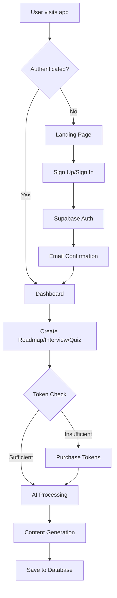

# 🚀 SmartLearn.io - AI-Powered Learning Platform
### Web + GenAI + ML

<div align="center">
  

  **Transform your learning journey with AI-generated roadmaps, mock interviews, and personalized quizzes**

  [](https://roadmap-generator-v2.vercel.app/)
  [](LICENSE)
  [](https://reactjs.org/)
  [](https://www.typescriptlang.org/)
  [](https://supabase.com/)
</div>

## 🧠 Machine Learning Model & Training

SmartLearn.io incorporates a robust Python-based Machine Learning pipeline to curate and rank the best educational YouTube videos for your roadmaps:
- **Topic Extraction & Data Collection**: The system NLP automatically determines the main subjects from your roadmap phase and fetches related video data sequentially through the YouTube Data API.
- **Feature Engineering**: Extensive sentiment analysis and engagement tracking are extracted from the metadata, analyzing likes, comment sentiment, and views-to-duration ratios to quantify the quality of instruction.
- **Random Forest Ranking**: A trained Random Forest model predicts the learning value and engagement potential for each video. The videos are then ranked, ensuring learners get the highest quality content.
- **Seamless Delivery**: Results are relayed directly to the sidebar of your roadmap interface, providing instant access to optimally selected resources alongside a localized fallback system.

## 📋 Table of Contents

- [✨ Features](#-features)
- [🎯 Demo](#-demo)
- [🛠️ Tech Stack](#️-tech-stack)
- [🚀 Quick Start](#-quick-start)
- [⚙️ Installation](#️-installation)
- [🔧 Configuration](#-configuration)
- [📱 Usage](#-usage)
- [🏗️ Architecture](#️-architecture)
- [🌐 Deployment](#-deployment)
- [🔌 API Reference](#-api-reference)
- [🎨 Customization](#-customization)
- [🤝 Contributing](#-contributing)
- [📄 License](#-license)

## ✨ Features

### 🎯 Core Features
- **AI-Powered Roadmap Generation**: Leverages Google's Gemini AI to create personalized learning paths
- **Interactive Tree Visualization**: Beautiful, interactive roadmap canvas with React Flow
- **Multi-Category Support**: Project development, travel planning, fitness goals, and custom roadmaps
- **Phase-Based Structure**: Each roadmap contains multiple phases with structured steps
- **Smart Progress Tracking**: Track completion status and navigate through roadmap phases

### 🎤 AI Mock Interviews
- **Voice-Enabled Interviews**: Real-time voice conversations using Vapi AI
- **Resume Analysis**: Upload and parse resumes for personalized interview questions
- **Speech Analysis**: Analyze filler words, pace, clarity, and speaking patterns
- **Comprehensive Reports**: Detailed feedback with strengths, improvements, and recommendations
- **Multiple Interview Modes**: Standard text-based or voice-only interviews

### 🧠 Quiz Generation
- **File-Based Quizzes**: Generate quizzes from uploaded PDF, DOCX, or Excel files
- **Topic-Based Quizzes**: Create quizzes from any subject or topic
- **Multiple Choice Questions**: AI-generated questions with explanations
- **Interactive Testing**: Real-time scoring and detailed answer explanations
- **Resume Parsing**: Extract skills and experience for targeted quiz creation

### 🔐 SaaS Features & User Management
- **Secure Authentication**: Email/password authentication with Supabase Auth
- **Token-Based Usage**: Pay-as-you-go model with token consumption tracking
- **Subscription Plans**: Free, Pro, and Enterprise tiers with different limits
- **Payment Integration**: Razorpay integration for seamless payments
- **User Dashboard**: Personal dashboard to view roadmaps, tokens, and history
- **Profile Management**: Update user information and view transaction history

### 🎨 User Experience
- **Responsive Design**: Fully responsive across all device sizes
- **Real-time Progress Tracking**: Visual progress indicators and completion tracking
- **Modern UI**: Clean, intuitive interface with smooth animations
- **Dark/Light Mode**: Theme switching capability
- **Keyboard Navigation**: Navigate through roadmaps using keyboard shortcuts

### 🎥 Rich Media Integration
- **Video Recommendations**: AI-powered YouTube video suggestions for each step
- **PDF Export**: Download beautifully formatted PDF versions of roadmaps
- **File Upload Support**: Support for PDF, DOCX, and Excel file processing
- **Interactive Maps**: Embedded maps for travel planning roadmaps

### 🔧 Technical Features
- **TypeScript**: Full type safety and enhanced developer experience
- **Modern React**: Built with React 18+ and modern hooks
- **Tailwind CSS**: Utility-first styling with custom theme system
- **Express Backend**: Robust Node.js/Express server with CORS support
- **Supabase Integration**: Full-stack authentication and database management
- **Multiple AI Providers**: Integration with Gemini, Mistral, OpenAI, and Vapi
- **Python ML Integration**: Machine learning scripts for video recommendations
- **Error Handling**: Comprehensive error handling and user feedback

## 🎯 Demo

🌐 **Live Demo**: [https://roadmap-generator-v2.vercel.app/](https://roadmap-generator-v2.vercel.app/)

### Example Use Cases
- **Learning React**: Complete roadmap from basics to advanced concepts with video tutorials
- **Planning a Japan Trip**: Comprehensive travel planning with cultural insights and maps
- **Building a SaaS Product**: End-to-end product development roadmap with milestones
- **Fitness Transformation**: Structured 90-day fitness journey with nutrition guidance
- **Mock Interview Practice**: Voice-enabled interviews with real-time feedback
- **Skill Assessment**: Generate quizzes from uploaded resumes or study materials

## 🛠️ Tech Stack

### Frontend
- **React 18.3.1** - Modern React with concurrent features
- **TypeScript 5.5.3** - Type-safe JavaScript
- **Tailwind CSS 3.4.1** - Utility-first CSS framework
- **React Flow 12.0.4** - Interactive node-based diagrams
- **React Router DOM 6.20.1** - Client-side routing
- **Lucide React** - Beautiful, customizable icons
- **Vite 5.4.2** - Fast build tool and dev server
- **Vapi Web SDK** - Voice AI integration

### Backend
- **Node.js** - JavaScript runtime
- **Express 4.18.2** - Web application framework
- **Google Generative AI** - Gemini AI integration for roadmaps
- **Mistral AI** - Additional AI capabilities for detailed instructions
- **OpenAI** - Advanced AI processing
- **Vapi AI** - Voice conversation AI
- **CORS 2.8.5** - Cross-origin resource sharing
- **Multer** - File upload handling
- **PDF-parse** - PDF document processing
- **Mammoth** - Word document processing
- **xlsx** - Excel file processing

### Database & Authentication
- **Supabase** - Backend-as-a-Service platform
- **PostgreSQL** - Robust relational database
- **Row Level Security** - Data protection and user isolation
- **Real-time subscriptions** - Live data updates

### Machine Learning & AI
- **Python 3.x** - ML script execution
- **YouTube Data API** - Video recommendation system
- **Natural Language Processing** - Text analysis and processing
- **Speech Recognition** - Voice input processing

### Payment & Business Logic
- **Razorpay** - Payment processing for Indian market
- **Token System** - Usage-based billing
- **Subscription Management** - Plan-based feature access
- **Transaction Tracking** - Payment and usage history

### Development Tools
- **ESLint** - Code linting and formatting
- **TypeScript ESLint** - TypeScript-specific linting rules
- **Autoprefixer** - CSS vendor prefixing
- **Concurrently** - Run multiple commands simultaneously
- **Dotenv** - Environment variable management

## 🚀 Quick Start

```bash
# Clone the repository
git clone https://github.com/HAIDER072/roadmap-generatorV2.git
cd roadmap-generatorV2

# Install dependencies
npm install

# Set up environment variables
cp .env.example .env
# Edit .env with your API keys and Supabase credentials

# Start development servers (frontend + backend)
npm run dev

# Open your browser
# Frontend: http://localhost:5173
# Backend: http://localhost:3001
```

## ⚙️ Installation

### Prerequisites
- **Node.js** (v18 or higher)
- **npm** or **yarn**
- **Python 3.x** (for ML features)
- **Supabase Account** (for database and authentication)
- **Google Gemini API Key** (required)
- **Mistral AI API Key** (recommended)
- **Vapi AI API Key** (for voice interviews)
- **Razorpay Account** (for payments)

### Step-by-Step Installation

1. **Clone the Repository**
   ```bash
   git clone https://github.com/HAIDER072/roadmap-generatorV2.git
   cd roadmap-generatorV2
   ```

2. **Install Dependencies**
   ```bash
   npm install
   ```

3. **Set up Supabase**
   - Create a new project at [supabase.com](https://supabase.com)
   - Go to Settings > API to get your project URL and anon key
   - Run the database migration (see Configuration section)

4. **Environment Setup**
   ```bash
   cp .env.example .env
   ```

5. **Configure Environment Variables**
   ```env
   # AI API Keys (required for full functionality)
   GEMINI_API_KEY=your_gemini_api_key_here
   MISTRAL_API_KEY=your_mistral_api_key_here
   OPENAI_API_KEY=your_openai_api_key_here
   VAPI_API_KEY=your_vapi_api_key_here
   YOUTUBE_API_KEY=your_youtube_api_key_here

   # Server configuration
   PORT=3001

   # Supabase configuration (required)
   VITE_SUPABASE_URL=your_supabase_project_url
   VITE_SUPABASE_ANON_KEY=your_supabase_anon_key

   # Payment configuration (for monetization)
   RAZORPAY_KEY_ID=your_razorpay_key_id
   RAZORPAY_KEY_SECRET=your_razorpay_key_secret
   ```

6. **Set up Database**
   - Connect to Supabase and run the SQL migration file located in `database/schema.sql`
   - This creates all necessary tables, policies, and seed data

7. **Python Environment (for ML features)**
   ```bash
   cd ml_model
   pip install -r requirements.txt
   cd ..
   ```

8. **Start Development**
   ```bash
   # Start both frontend and backend
   npm run dev

   # Or start individually
   npm run server  # Backend only
   npx vite        # Frontend only
   ```

## 🔧 Configuration

### Environment Variables

| Variable | Description | Required | Default |
|----------|-------------|----------|---------|
| `VITE_SUPABASE_URL` | Supabase project URL | Yes | - |
| `VITE_SUPABASE_ANON_KEY` | Supabase anonymous key | Yes | - |
| `GEMINI_API_KEY` | Google Gemini AI API key | Yes | - |
| `MISTRAL_API_KEY` | Mistral AI API key | Recommended | - |
| `OPENAI_API_KEY` | OpenAI API key | Optional | - |
| `VAPI_API_KEY` | Vapi AI API key for voice | Recommended | - |
| `YOUTUBE_API_KEY` | YouTube Data API key | Optional | - |
| `RAZORPAY_KEY_ID` | Razorpay public key | For payments | - |
| `RAZORPAY_KEY_SECRET` | Razorpay secret key | For payments | - |
| `PORT` | Backend server port | No | 3001 |

*Note: Without AI API keys, the app runs in fallback mode with basic functionality.

### Getting API Keys

#### Supabase Setup
1. Visit [supabase.com](https://supabase.com) and create an account
2. Create a new project
3. Go to Settings > API to get your project URL and keys
4. Copy the URL and anon key to your `.env` file

#### Gemini API Key
1. Visit [Google AI Studio](https://makersuite.google.com/app/apikey)
2. Sign in with your Google account
3. Create a new API key
4. Copy the key to your `.env` file

#### Mistral AI Key
1. Visit [Mistral AI Console](https://console.mistral.ai/)
2. Create an account and get your API key
3. Copy the key to your `.env` file

#### Vapi AI Key
1. Visit [Vapi Dashboard](https://dashboard.vapi.ai/)
2. Create an account and get your API key
3. Copy the key to your `.env` file

#### Razorpay Setup
1. Visit [Razorpay Dashboard](https://dashboard.razorpay.com/)
2. Create an account and get your key ID and secret
3. Copy the keys to your `.env` file

### Database Migration

The app includes a comprehensive Supabase migration that sets up:
- `user_profiles` table with token management
- `token_transactions` table for usage tracking
- `subscription_plans` table for pricing tiers
- `payments` table for transaction records
- `roadmaps` table for user-generated content
- Row Level Security (RLS) policies for data protection
- Indexes for performance optimization
- Triggers for automatic timestamps

To apply the migration:
1. Connect to your Supabase project dashboard
2. Go to SQL Editor
3. Copy and paste the contents of `database/schema.sql`
4. Execute the migration

## 📱 Usage

### Getting Started

1. **Sign Up**: Create an account using email and password
2. **Email Confirmation**: Check your email and confirm your account
3. **Token Allocation**: New users receive 100 free tokens
4. **Dashboard**: Access your personal dashboard

### Creating a Roadmap

1. **Navigate to Create**: Click the "Create Roadmap" button
2. **Select Category**: Choose from Project, Travel, Fitness, or Custom
3. **Describe Goal**: Enter a detailed description of what you want to achieve
4. **AI Generation**: Click "Generate" to create your personalized roadmap
5. **Interactive View**: Explore your roadmap with the visual canvas
6. **Track Progress**: Mark steps as completed and track overall progress

### Mock Interview Practice

1. **Access Interviews**: Navigate to the "Mock Interview" section
2. **Upload Resume**: Upload your resume (PDF/DOCX) for personalized questions
3. **Choose Position**: Specify the job position you're preparing for
4. **Select Mode**: Choose between text-based or voice-enabled interviews
5. **Start Interview**: Begin the conversation with AI interviewer
6. **Receive Feedback**: Get comprehensive feedback and recommendations

### Quiz Generation

1. **Choose Input Method**: Upload a file or enter a topic
2. **Supported Formats**: PDF, DOCX, XLSX files or text topics
3. **Set Parameters**: Choose number of questions and difficulty
4. **Generate Quiz**: AI creates multiple-choice questions
5. **Take Quiz**: Answer questions and receive instant feedback
6. **Review Results**: See detailed explanations and performance analysis

### Token Management

- **Free Tier**: 100 tokens for new users
- **Token Usage**: Roadmaps cost 1 token, interviews cost 2 tokens
- **Purchase Tokens**: Buy additional tokens via Razorpay integration
- **Usage Tracking**: Monitor token consumption in your dashboard
- **Subscription Plans**: Upgrade to Pro/Enterprise for unlimited usage

### File Processing Features

- **Resume Parsing**: Extract skills, experience, and qualifications
- **Document Analysis**: Process PDF, Word, and Excel files
- **Content Extraction**: AI-powered text extraction and analysis
- **Quiz Generation**: Create assessments from uploaded materials

## 🏗️ Architecture

### Project Structure

```
roadmap-generatorV2/
├── public/                 # Static assets
│   └── _redirects         # Netlify redirect rules
├── server/                # Backend server
│   ├── index.js          # Express server with AI integrations
│   └── mlService.js      # Python ML script orchestration
├── src/
│   ├── components/       # React components
│   │   ├── auth/         # Authentication components
│   │   ├── dashboard/    # Dashboard and profile components
│   │   ├── home/         # Landing page components
│   │   ├── interview/    # Mock interview components
│   │   │   ├── MockInterview.tsx      # Main interview component
│   │   │   └── VapiVoiceInterview.tsx # Voice interview integration
│   │   ├── CustomEdge.tsx           # React Flow custom edges
│   │   ├── CustomRoadmapNode.tsx    # React Flow custom nodes
│   │   ├── MessageInput.tsx         # Input component for goals
│   │   ├── Navbar.tsx              # Navigation component
│   │   ├── NodeDetail.tsx           # Step detail modal
│   │   ├── PhaseDetail.tsx          # Phase detail modal
│   │   ├── ProtectedRoute.tsx       # Route protection
│   │   ├── RoadmapCanvas.tsx        # Main canvas component
│   │   ├── StepsPanel.tsx           # Sidebar progress panel
│   │   └── VideoSidebar.tsx         # Video recommendations
│   ├── contexts/         # React contexts
│   │   ├── AuthContext.tsx          # Authentication context
│   │   ├── ProfileContext.tsx       # User profile context
│   │   └── ThemeContext.tsx         # Theme management
│   ├── lib/              # Library configurations
│   │   └── supabase.ts              # Supabase client setup
│   ├── pages/            # Page components
│   │   ├── CreateRoadmapPage.tsx    # Roadmap creation page
│   │   ├── HomePage.tsx             # Landing page
│   │   ├── InterviewDemo.jsx        # Interview demo page
│   │   ├── ProfilePage.tsx          # User profile page
│   │   ├── QuizGeneratorPage.tsx    # Quiz generation page
│   │   └── RoadmapViewerPage.tsx    # Roadmap viewing page
│   ├── services/         # API services
│   │   ├── aiInterviewService.js    # Interview API calls
│   │   ├── api.ts                   # General API utilities
│   │   ├── razorpayService.ts       # Payment integration
│   │   ├── roadmapService.ts        # Roadmap database operations
│   │   └── tokenService.ts          # Token management
│   ├── types/            # TypeScript definitions
│   │   └── index.ts                 # Core type definitions
│   ├── utils/            # Utility functions
│   │   ├── mockAI.ts                # Fallback AI responses
│   │   └── themes.ts                # Category theme system
│   ├── App.tsx           # Main application component
│   └── main.tsx          # Application entry point
├── database/             # Database files
│   └── schema.sql        # Supabase database schema
├── ml_model/             # Python ML scripts
│   ├── collect_data.py   # Data collection scripts
│   ├── pipeline_runner.py # ML pipeline execution
│   ├── train_and_rank.py # Model training
│   ├── requirements.txt  # Python dependencies
│   └── ...               # Additional ML utilities
├── supabase/             # Supabase configurations
│   └── migrations/       # Database migration files
├── .env.example          # Environment variables template
├── package.json          # Dependencies and scripts
├── tailwind.config.js    # Tailwind CSS configuration
├── vite.config.ts        # Vite build configuration
└── README.md            # This file
```

### Authentication Flow


```mermaid
graph TD
    A[User visits app] --> B{Authenticated?}
    B -->|No| C[Landing Page]
    B -->|Yes| D[Dashboard]
    C --> E[Sign Up/Sign In]
    E --> F[Supabase Auth]
    F --> G[Email Confirmation]
    G --> D
    D --> H[Create Roadmap/Interview/Quiz]
    H --> I{Token Check}
    I -->|Sufficient| J[AI Processing]
    I -->|Insufficient| K[Purchase Tokens]
    K --> J
    J --> L[Content Generation]
    L --> M[Save to Database]
```

### Data Flow

1. **User Authentication** → Supabase Auth with JWT tokens
2. **Token Validation** → Check user's token balance
3. **AI Processing** → Route to appropriate AI service (Gemini/Mistral/OpenAI)
4. **Content Generation** → Process and format AI responses
5. **Database Storage** → Save with RLS policies
6. **Real-time Updates** → Supabase subscriptions for live data
7. **File Processing** → Multer for uploads, AI for content extraction
8. **Payment Processing** → Razorpay integration for token purchases

## 🌐 Deployment

### Frontend Deployment (Netlify)

The frontend is deployed to Netlify with automatic builds:

🌐 **Live URL**: [https://roadmap-generator-v2.vercel.app/](https://roadmap-generator-v2.vercel.app/)

For manual deployment:

```bash
# Build the project
npm run build

# Deploy to Netlify (install Netlify CLI first)
npm install -g netlify-cli
netlify login
netlify deploy --prod --dir=dist
```

**Netlify Configuration**:
- **Build command**: `npm run build`
- **Publish directory**: `dist`
- **Environment variables**: Set `VITE_*` variables in Netlify dashboard

### Backend Deployment (Render)

The backend is deployed to Render for reliable Node.js hosting:

#### Step 1: Prepare for Render Deployment

1. **Update CORS Configuration** in `server/index.js`:
   ```javascript
   app.use(cors({
     origin: [
       'http://localhost:5173',
       'http://127.0.0.1:5173',
       'https://roadmap-generator-v2.vercel.app',  // Your frontend URL
       'https://your-backend-name.onrender.com'  // Your Render backend URL
     ],
     credentials: true
   }));
   ```

#### Step 2: Deploy to Render

1. **Connect Repository**:
   - Go to [Render Dashboard](https://dashboard.render.com)
   - Click "New +" → "Web Service"
   - Connect your GitHub repository

2. **Configure Service**:
   - **Name**: `smartlearn-backend`
   - **Environment**: `Node`
   - **Build Command**: `npm install && pip install -r ml_model/requirements.txt`
   - **Start Command**: `node server/index.js`

3. **Set Environment Variables**:
   - All server-side environment variables (without `VITE_` prefix)
   - `PYTHONPATH`: `/opt/render/project/ml_model` (for Python scripts)

4. **Database Connection**:
   - Ensure Supabase URL is accessible from Render

### Database Deployment (Supabase)

Supabase handles database hosting automatically:

1. **Production Database**: Automatically provisioned with your Supabase project
2. **Migrations**: Apply schema.sql to set up tables and policies
3. **Backups**: Automatic daily backups included
4. **Scaling**: Automatic scaling based on usage

### Python ML Deployment

For ML features to work in production:

1. **Render Python Support**: Render supports Python in Node.js services
2. **Requirements**: Include `ml_model/requirements.txt` in build
3. **Path Configuration**: Set `PYTHONPATH` to ML directory
4. **Alternative**: Deploy ML as separate microservice if needed

## 🔌 API Reference

### Authentication Endpoints

All authentication is handled by Supabase Auth:

- **Sign Up**: `supabase.auth.signUp()`
- **Sign In**: `supabase.auth.signInWithPassword()`
- **Sign Out**: `supabase.auth.signOut()`
- **User Session**: `supabase.auth.getSession()`

### Roadmap Endpoints

#### Generate Roadmap
```http
POST /api/generate-roadmap
```

**Request Body**:
```json
{
  "prompt": "Learn React development from scratch",
  "category": "project",
  "travelData": null
}
```

**Response**:
```json
{
  "roadmap": {
    "id": "uuid",
    "title": "React Development Roadmap",
    "phases": [...],
    "user_id": "uuid",
    "tokens_used": 1
  }
}
```

#### Get User Roadmaps
```http
GET /api/user-roadmaps/:userId
```

#### Update Roadmap Progress
```http
PUT /api/roadmap-progress/:roadmapId
```

### Interview Endpoints

#### Start Mock Interview
```http
POST /api/mock-interview/start
```

**Request Body**:
```json
{
  "position": "Frontend Developer",
  "resumeText": "...",
  "questionCount": 5,
  "duration": 10
}
```

#### Generate Interview Report
```http
POST /api/mock-interview/report
```

#### Voice Response Processing
```http
POST /api/mock-interview/voice-response
```

### Quiz Endpoints

#### Generate Quiz from File
```http
POST /api/generate-quiz
Content-Type: multipart/form-data
```

**Form Data**:
- `file`: PDF/DOCX/XLSX file
- `questionsCount`: number of questions

#### Generate Quiz from Topic
```http
POST /api/generate-quiz
```

**Request Body**:
```json
{
  "topic": "JavaScript Fundamentals",
  "questionsCount": 10
}
```

### Payment Endpoints

#### Create Razorpay Order
```http
POST /api/create-razorpay-order
```

**Request Body**:
```json
{
  "planId": "pro-plan",
  "amount": 899
}
```

#### Verify Payment
```http
POST /api/verify-razorpay-payment
```

### Utility Endpoints

#### Health Check
```http
GET /api/health
```

**Response**:
```json
{
  "status": "ok",
  "timestamp": "2024-01-01T00:00:00Z",
  "services": {
    "supabase": "connected",
    "gemini": "configured",
    "razorpay": "configured"
  }
}
```

#### Parse Resume
```http
POST /api/parse-resume
Content-Type: multipart/form-data
```

**Form Data**:
- `resume`: PDF file

#### Get Video Recommendations
```http
POST /api/get-video-recommendations
```

**Request Body**:
```json
{
  "topic": "React Hooks",
  "maxVideos": 5
}
```

## 🎨 Customization

### Adding New Categories

1. **Update Types** (`src/types/index.ts`):
   ```typescript
   export type Category = 'project' | 'travel' | 'fitness' | 'cooking' | 'new_category';
   ```

2. **Add Theme** (`src/utils/themes.ts`):
   ```typescript
   new_category: {
     primary: '#your-color',
     secondary: '#your-secondary-color',
     accent: '#your-accent-color',
     background: '#your-background-color',
     text: '#your-text-color'
   }
   ```

3. **Update AI Prompts** in `server/index.js` for the new category

### Customizing AI Prompts

Edit the prompt templates in `server/index.js`:

```javascript
const ROADMAP_PROMPTS = {
  project: `Generate a detailed roadmap for: {prompt}...`,
  new_category: `Generate a specialized roadmap for: {prompt}...`
};
```

### Styling Customization

The app uses Tailwind CSS with a custom theme system:

- **Colors**: Update category themes in `src/utils/themes.ts`
- **Components**: Each component has its own styling
- **Responsive**: Built-in responsive design patterns
- **Dark Mode**: Automatic theme switching support

### Adding New AI Providers

1. **Install SDK**: Add new AI provider package
2. **Environment Variables**: Add API key configuration
3. **Service Integration**: Create service wrapper in `server/index.js`
4. **Fallback Logic**: Update error handling and fallbacks

## 🤝 Contributing

We welcome contributions! Here's how to get started:

### Development Setup

1. **Fork the Repository**
2. **Clone Your Fork**
3. **Create Feature Branch**: `git checkout -b feature/amazing-feature`
4. **Make Changes** and test thoroughly
5. **Commit Changes**: `git commit -m 'Add amazing feature'`
6. **Push to Branch**: `git push origin feature/amazing-feature`
7. **Open Pull Request**

### Contribution Guidelines

- **Code Style**: Follow existing TypeScript and React patterns
- **Testing**: Test your changes across different categories and scenarios
- **Documentation**: Update README.md if adding new features
- **Database**: Test migrations and RLS policies thoroughly
- **Security**: Ensure all user data is properly protected

### Areas for Contribution

- 🎨 **UI/UX Improvements**: Enhanced animations, better responsive design
- 🤖 **AI Integration**: Support for additional AI providers
- 📊 **Analytics**: User behavior tracking and roadmap analytics
- 🔧 **Features**: Advanced export options, sharing capabilities
- 🌐 **Internationalization**: Multi-language support
- 📱 **Mobile**: Enhanced mobile experience and PWA features
- 🎯 **Categories**: New roadmap categories and templates
- 🎤 **Interview Features**: Additional interview types and analysis
- 🧠 **Quiz Features**: More question types and assessment methods

## 📄 License

This project is licensed under the MIT License - see the [LICENSE](LICENSE) file for details.

## 🙏 Acknowledgments

- **Google Gemini AI** - For powering intelligent roadmap generation
- **Mistral AI** - For detailed instruction generation
- **OpenAI** - For advanced AI processing capabilities
- **Vapi AI** - For voice conversation technology
- **Supabase** - For authentication and database infrastructure
- **React Flow** - For beautiful interactive diagrams
- **Razorpay** - For seamless payment processing
- **Tailwind CSS** - For utility-first styling system
- **Lucide React** - For the beautiful icon system
- **Netlify** - For seamless frontend deployment
- **Render** - For reliable backend hosting
- **YouTube Data API** - For video recommendations

## 📞 Support

- **Issues**: [GitHub Issues](https://github.com/HAIDER072/roadmap-generatorV2/issues)
- **Discussions**: [GitHub Discussions](https://github.com/HAIDER072/roadmap-generatorV2/discussions)
- **Live Demo**: [https://roadmap-generator-v2.vercel.app/](https://roadmap-generator-v2.vercel.app/)

---

<div align="center">
  <p>Made with ❤️ by the SmartLearn Team</p>
  <p>
    <a href="https://roadmap-generator-v2.vercel.app/">Live Demo</a> •
    <a href="#-features">Features</a> •
    <a href="#-quick-start">Quick Start</a> •
    <a href="#-deployment">Deployment</a>
  </p>
</div>
- **Real-time subscriptions** - Live data updates

